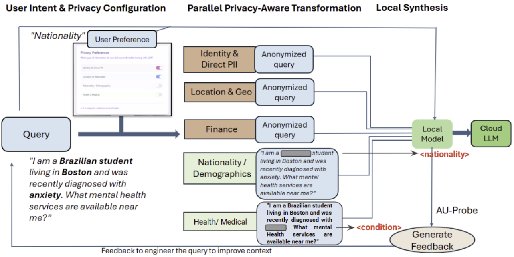

# PACT: Privacy-Aware Cloud Transmission

## What Is PACT?

Every time a user types a query into a cloud AI - asking about a medical condition, filling out a financial form, or describing a personal situation - the entire message goes to an external server, word for word. The user typically does not realize they are handing their most sensitive information to a third party they have no control over. There is no mechanism in standard AI interfaces to scrub that data before it leaves the device.

PACT is a local privacy middleware that sits between the user and a cloud LLM. It intercepts the user's prompt before it is sent, identifies sensitive personal information across five configurable categories, and replaces it with anonymized placeholders. Only the sanitized version of the prompt is forwarded to the cloud. The cloud LLM never sees the original.

The gap PACT fills is not just technical - it is behavioral. Most privacy tools require the user to know what to redact and to do it manually. PACT makes redaction automatic, configurable, and transparent, while still giving the user a useful AI response.



---

## How It Works

1. The user submits a prompt and selects which privacy categories to protect (Identity, Location, Demographics, Health, Financial).
2. Five redaction modules run in parallel. Each module processes the query against its own category and returns a redacted version.
3. Local Llama 3.1:8b (via Ollama) synthesizes the five redacted candidates into a single coherent prompt, merging the best redaction decisions from each module.
4. The synthesized prompt is scored by the AU-Probe, a linear classifier trained on Llama 3.1:8b embeddings. If the score exceeds the user-configured threshold, the prompt is flagged as too degraded to be useful and the user is asked to rephrase. Otherwise the sanitized prompt is forwarded to OpenAI GPT-4o-mini.
5. The AI response is returned to the user. The original query never leaves the machine.
6. Within a session, PACT maintains up to 20 prior exchanges as conversation context for GPT. Only the redacted versions of previous prompts and their responses are kept in history - the originals are never retained.

---

## Code Files

### `backend/server.py`

FastAPI server exposing the pipeline over HTTP. Handles the `/chat` endpoint which drives the full pipeline: module collection, Llama synthesis, AU-Probe scoring, and the GPT call. Also exposes `/local-llama/status`, `/local-llama/load`, `/chat/batch-from-file`, and `/extract/text`. The AU threshold is accepted as a per-request parameter (`au_threshold`) so users can configure it from the UI. Conversation history (up to 20 exchanges of redacted prompts and responses) is accepted as a `history` field and forwarded to GPT to enable multi-turn dialogue within a session.

### `modules/local_llama.py`

Wrapper for all LLM functionality in the local version. Communicates with a locally running Ollama instance over HTTP. Provides:
- `load_model()` - verifies Ollama is running and the model is pulled
- `load_au_probe()` - loads the linear probe weights from a `.pt` file
- `get_au_uncertainty()` - fetches a 4096-d embedding from Ollama's `/api/embeddings` endpoint and scores it with the probe: `score = sigmoid(w · embedding + b)`
- `generate_text()` - calls Ollama to run text generation or chat completion

### `modules/pipeline_collect.py`

Orchestrates all five redaction modules. Runs identity, location, demographic, and financial modules concurrently using `ThreadPoolExecutor`. The health module runs separately after the local modules so it receives a pre-sanitized version of the query rather than the original. Also provides `sequential_redaction_pipeline` for large documents where Llama synthesis is too slow.

### `modules/identity_module.py`

Detects and redacts personally identifiable information: full names, Social Security numbers, passport numbers, driver license numbers, email addresses, and phone numbers. Uses spaCy's `en_core_web_sm` model for named entity recognition combined with regex patterns for structured identifiers.

### `modules/modules_geo.py`

Detects and redacts geographic information: street addresses, city names, state and country references, and ZIP codes. Uses spaCy NER with geographic entity labels (GPE, LOC, FAC).

### `modules/demographic_module.py`

Detects and redacts demographic attributes: age, gender, race, ethnicity, and nationality. Uses a combination of spaCy NER and regex pattern matching for age expressions.

### `modules/health_module.py`

Detects and redacts medical information. Uses local Llama via Ollama as the detector, sending a structured system prompt that defines four categories: CONDITION, MEDICATION, SYMPTOM, and PROCEDURE. Temperature is set to 0 for deterministic output. Falls back gracefully if Ollama is unavailable.

### `modules/financial_detector.py`

Rule-based financial PII detector with structural validation:
- Credit and debit card numbers validated via the Luhn algorithm
- Bank account and routing numbers (ABA format)
- IBAN and SWIFT codes
- Cryptocurrency wallet addresses
- Income and salary references

### `modules/synthesis_prompt.py`

Builds the prompt sent to local Llama that merges all module candidates into a single best-redacted version. The original user query is not included in this prompt - only the redacted candidates are passed. Also provides `extract_final_prompt` to parse Llama's output and `is_synthesis_unusable` to detect refusals or incoherent output.

### `modules/extract_docs.py`

Extracts plain text from uploaded files. Uses PyMuPDF for PDF files and pytesseract (Tesseract OCR) for image files (PNG, JPG, TIFF).

### `scripts/retrain_probe_llama.py`

Retrains the AU-Probe using 4096-d embeddings from Ollama (llama3.1:8b). Builds a paired dataset of 254 examples: each base prompt is paired with its redacted version, giving targets of 0.0 (original) and the actual redaction ratio (redacted). Trains a Ridge regression model so the probe directly predicts degree of redaction rather than binary presence. Saves `w`, `b`, and `probe_type="regression"` to `data/au_probe/linearprobe_layer_32.pt`. Requires Ollama to be running.

### `scripts/retrain_probe_minilm.py`

Identical labeling logic but uses `all-MiniLM-L6-v2` (sentence-transformers) for 384-d embeddings instead of Ollama. Saves to `data/au_probe/minilm_probe.pt`. Used by the deployment version. Runs without Ollama.

### `scripts/test_local_llama.py`

Test script for exercising the local pipeline manually without the frontend. Useful for verifying Ollama connectivity and AU-Probe output on sample queries.

### `data/au_probe/linearprobe_layer_32.pt`

Trained probe weights for the local version. Contains `w` (shape [4096]), `b`, and `probe_type="regression"`. Trained on 254 paired examples using Ridge regression with continuous redaction-ratio targets. R²: 0.9586, MAE: 0.034.

### `data/au_probe/minilm_probe.pt`

Trained probe weights for the deployment version. Contains `w` (shape [384]), `b`, and metadata. Trained on MiniLM embeddings. ROC-AUC: 0.9818.

### `data/queries.json`

Sample queries for batch testing via the "Run data/queries.json" button. Each entry specifies a query, enabled modules, and an API key placeholder.

---

## Project Structure

```
IS597-Project-PACT/
├── backend/
│   └── server.py                   # FastAPI backend
├── frontend/
│   ├── index.html                  # Main UI
│   ├── app.js                      # Frontend logic
│   └── style.css                   # Styling
├── modules/
│   ├── local_llama.py              # Ollama wrapper + AU-Probe
│   ├── pipeline_collect.py         # Module orchestration
│   ├── synthesis_prompt.py         # Candidate merging prompt builder
│   ├── identity_module.py          # Name, SSN, email, phone redaction
│   ├── modules_geo.py              # Address and location redaction
│   ├── demographic_module.py       # Age, gender, race redaction
│   ├── health_module.py            # Medical entity redaction via local Llama
│   ├── financial_detector.py       # Card, account, and income redaction
│   └── extract_docs.py             # PDF and image text extraction
├── scripts/
│   ├── retrain_probe_llama.py      # Retrain AU-Probe on Llama embeddings
│   ├── retrain_probe_minilm.py     # Retrain AU-Probe on MiniLM embeddings
│   └── test_local_llama.py         # Manual pipeline test script
├── data/
│   ├── au_probe/
│   │   ├── linearprobe_layer_32.pt # Local version probe weights (4096-d)
│   │   └── minilm_probe.pt         # Deployment version probe weights (384-d)
│   └── queries.json                # Sample queries for batch testing
├── deployment_version/             # Cloud-hosted demo (Railway + GitHub Pages)
│   ├── backend/
│   │   └── server.py
│   ├── frontend/
│   │   ├── index.html
│   │   ├── app.js
│   │   ├── style.css
│   │   └── config.js               # Set BACKEND_URL here before deploying
│   ├── modules/                    # Same modules, Groq instead of Ollama
│   ├── data/
│   │   └── au_probe/
│   │       └── minilm_probe.pt
│   ├── Procfile                    # Railway start command
│   ├── requirements.txt
│   ├── .env.example
│   └── README.md                   # Deployment-specific instructions
├── requirements.txt
└── README.md
```

---

## Setup and Running the Local Version

### Prerequisites

- Python 3.10 or higher
- [Ollama](https://ollama.com) (local LLM runtime)
- An OpenAI API key (for the final GPT response)

---

### Step 1 - Install Ollama

**Windows / macOS:** Download and run the installer from [https://ollama.com/download](https://ollama.com/download).

**Linux:**
```bash
curl -fsSL https://ollama.com/install.sh | sh
```

---

### Step 2 - Pull the Llama 3.1 model

```bash
ollama pull llama3.1:8b
```

This downloads approximately 4.7 GB. Only required once.

---

### Step 3 - Clone the repository

```bash
git clone https://github.com/AnushreeU13/IS597-Project-PACT.git
cd IS597-Project-PACT
```

---

### Step 4 - Create and activate a virtual environment (recommended)

**Windows:**
```powershell
python -m venv venv
venv\Scripts\activate
```

**macOS / Linux:**
```bash
python -m venv venv
source venv/bin/activate
```

---

### Step 5 - Install Python dependencies

```bash
pip install -r requirements.txt
python -m spacy download en_core_web_sm
```

---

### Step 6 - Start the backend

```bash
python backend/server.py
```

You should see:
```
AU probe loaded OK  path=...linearprobe_layer_32.pt  layer=32  weight_shape=torch.Size([4096])
Ollama model ready: llama3.1:8b at http://localhost:11434
Uvicorn running on http://0.0.0.0:8000
```

---

### Step 7 - Open the frontend

Open `frontend/index.html` directly in your browser, or from the terminal:

**Windows:**
```powershell
start frontend/index.html
```

**macOS:**
```bash
open frontend/index.html
```

---

### Step 8 - Configure the UI

In the left sidebar:

1. Paste your **OpenAI API key** (`sk-...`) into the API key field. It is stored in session storage for the current tab only and is never logged server-side.
2. Select an **AU-Probe threshold** from the dropdown. Lower thresholds are stricter - they block prompts that have lost significant context. Higher thresholds are more permissive.
3. Toggle the **privacy categories** you want to redact before sending a query.

---

### Retraining the AU-Probe (optional)

If you want to retrain the probe on new prompt data:

```bash
# Requires Ollama running with llama3.1:8b
python scripts/retrain_probe_llama.py
```

This takes approximately 40 minutes on CPU (488 prompts × ~4s per embedding). The updated weights are saved to `data/au_probe/linearprobe_layer_32.pt` automatically.

---

## AU-Probe

The AU-Probe gates whether a sanitized prompt should be forwarded to the cloud. After redaction, prompts sometimes lose so much context that the LLM cannot give a useful response. The probe detects this state and flags the prompt before wasting an API call.

**How it works:** Ollama is called to produce a 4096-dimensional embedding for the synthesized prompt. The probe applies a Ridge regression score: `score = clip(w · embedding + b, 0, 1)`, where `w` and `b` were fitted on 254 paired examples with continuous redaction-ratio targets. Each base prompt is paired with its redacted version; the original is assigned a target of 0.0 and the redacted version is assigned its actual redaction ratio (redacted characters / total characters). A score close to 1 indicates the prompt is too degraded. The threshold is set by the user in the UI.

**Training results:**
- Total examples: 254 (127 original prompts + 127 redacted counterparts)
- R²: 0.9586
- MAE: 0.034

---

## Troubleshooting

**Ollama not running** - Verify with `ollama list`. If nothing appears, start Ollama from the desktop app or run `ollama serve`.

**"Model not found"** - Run `ollama pull llama3.1:8b` and restart the backend.

**Port conflict on 11434** - If both the Ollama CLI and the Ollama Desktop app are installed, only one should be running. Open Task Manager and ensure only one `ollama` process is active.

**Slow first response** - The first request loads the model into memory. Subsequent requests are faster.

**Health module returns no candidates** - The health module uses local Llama via Ollama. Verify Ollama is running and `llama3.1:8b` is pulled. The pipeline continues without health candidates if the module fails.

**Package conflicts** - Use a virtual environment and install exact versions:
```bash
pip install -r requirements.txt --force-reinstall
```

---

## Authors

Anushree Udhayakumar, Gawon Lim, Jesse Marsh

IS597 - Human-Centered Data Science, University of Illinois Urbana-Champaign
